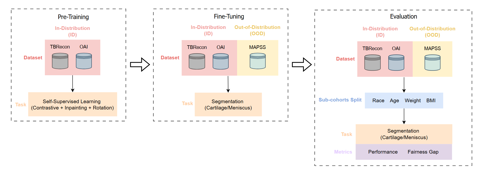
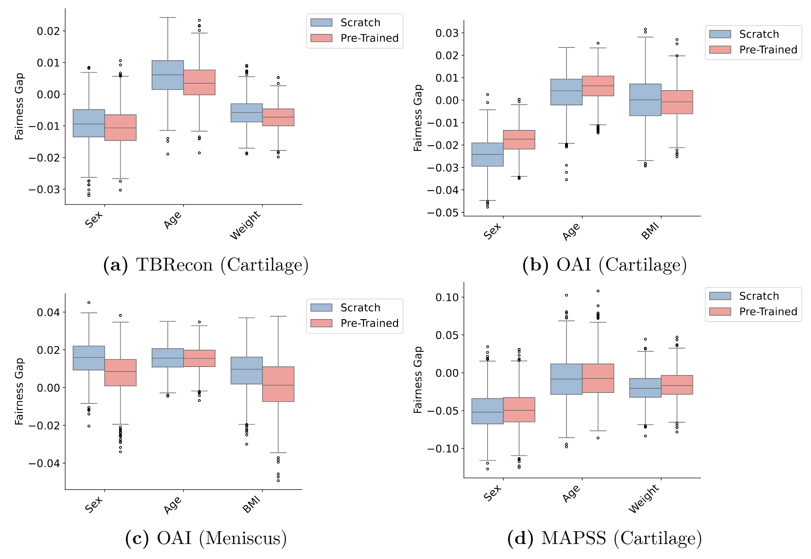
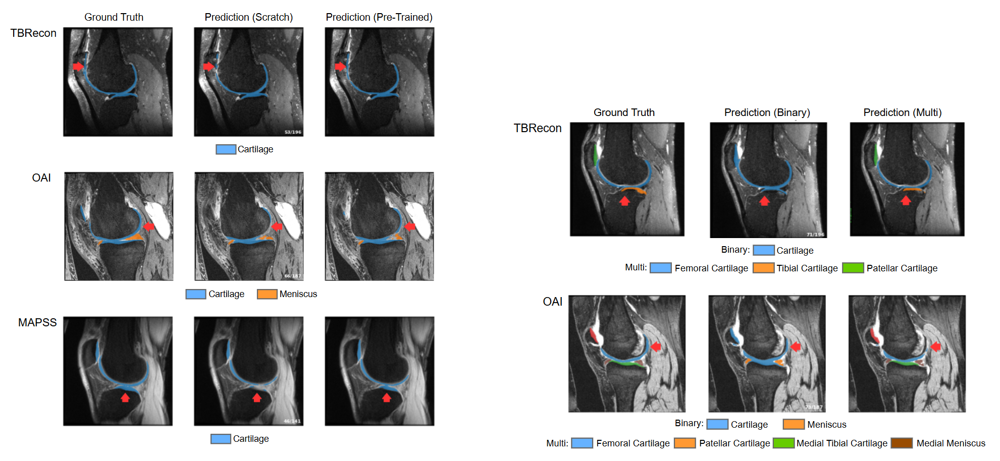

# Fairness-Musculoskeletal Segmentation

This repostiory contains code for pre-training and evaluating Musculoskeletal Imaging Segmentation with self-supervised learning for
model fairness evaluation.

## Abstract
Pre-training deep-learning models is an important strategy for data-efficient algorithm development. However, pre-trained algorithms may introduce bias when pre-training data is derived from skewed populations not representative of the model's target demographics. The underlying dataset bias may in turn adversely affect model fairness in under-represented groups. This study investigates whether the use of self-supervised learning (SSL) in musculoskeletal segmentation of knee magnetic resonance imaging  (MRI) scans adversely affects model fairness. We utilized three knee MRI datasets, partitioned into in-distribution (ID) and out-of-distribution (OOD) data, to assess whether (1) self-supervised learning leads to an improvement in downstream task performance and (2) whether that improvement comes at the expense of worsening model fairness. Specifically, we compared model performance of cartilage and meniscus segmentation on both ID and OOD datasets after training models either from scratch or using SSL pre-training with 1,823 unlabeled ID scans. We found that pre-training improved segmentation on the majority of tasks on both ID and OOD downstream data. Furthermore, fairness analysis revealed no substantial difference in the fairness gap due to sex, age, or weight between un-pre-trained vs. pre-trained models. We confirmed that ID and OOD data have distinct statistical distributions and conclude that the fairness gap is unaffected even when utilizing statistically distinct data for pre-training. Our findings suggest that SSL pre-training can efficiently leverage unlabeled data to enhance model performance in musculoskeletal segmentation and does not always negatively impacting model fairness due to dataset bias. 



## Fairness Evaluation
Fairness Gap Plot: the plot shows the fairness gap turkey plots for different classes on three different musculoskeletal imaging datasets. Blue and red caps indicate 95% confidence intervals for models trained from scratch and pre-trained, respectively. Our evaluation shows there is no statistically significant indication of fairness gap for model fine-tuned from scratch vs. from pre-trained weights.



## Segmentation Samples
We show segmentation samples for model fine-tuned from scratch vs. from pre-trained weights below, where the red arrow indicate the area that pre-trained model gives better segmentation. Pre-trained model outperforms model trained from scratch in majority of classes with more numerical evaluation details presented in our paper.



## Dependencies
Check requirements.txt for dependencies of this repository or install them by running
```
pip install -r ./requirements.txt
```

## Train Model for Downstream
### Fine-tuning
Example for fine-tuning with 1 GPU, check
```
./configs/finetune/*.yaml
```
for fine-tuning method for other datasets and pre-defined hyper-parameters
```
torchrun --nnodes 1 --nproc_per_node 1 --master_port 12345 ./main_finetune.py --local_rank 0 \
    --model_name "vit" --num_workers 4 --max_epochs 800 --base_lr 1e-4 \
    --cfg ./configs/finetune/swinunetr_TBRecon_cartilage.yaml --use_amp \
    --optimizer "AdamW" --scheduler "cosine" --weight_decay 0.01 --grad_clip 1.0 \
    --model_load_path <Pre-Trained Model Path Here>
```

## Pre-train Model
### Pre-training
Example for pre-tuning with 1 GPU (our training used 4 GPUs), check
```
./configs/finetune/swinunetr_TBRecon_cartilage.yaml
```
for other pre-defined hyper-parameters
```
torchrun --nnodes 1 --nproc_per_node 1 --master_port 12345 ./main_pretrain_ssl.py --local_rank 0 \
    --model_name "vit" --num_workers 4 --max_epochs 800 --base_lr 1e-4 \
    --cfg ./configs/ssl/swinunetr_TBRecon.yaml --use_amp \
    --optimizer "AdamW" --scheduler "cosine" --weight_decay 0.01 --grad_clip 1.0 \
    --model_load_path <Pre-Trained Model Path Here>
```

## Fairness Evaluation
Evaluate model fairness ''compute_fairness'' function
in 
```
./fariness_eval.py
```
### Usage
Assume having list of some performance scores from model 1 and model 2 with two sub-cohorts (A, B) or three sub-cohorts (A, B, C)
```
compute_fairness(listA1, listA2, listB1, listB2, n_iterations=1000)
```
for two sub-cohorts case
or
```
compute_fairness(listA1, listA2, listB1, listB2, listC1, listC2, n_iterations=1000)
```
for three sub-cohorts case